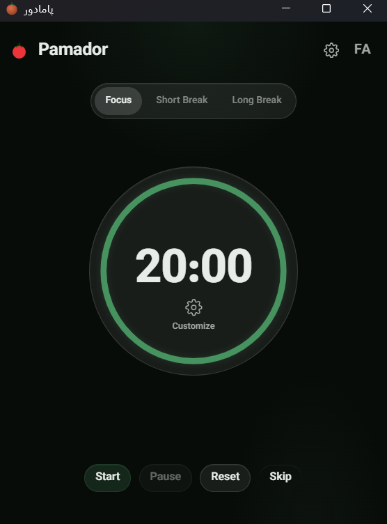

# Pamador 🍅

<p align="center">
  <a href="README.md">فارسی</a>
</p>

**Pamador** is a Pomodoro timer for the desktop — built with **Tauri 2** and **React**.

<p align="center">
  
</p>

## Pamador Pomodoro Timer Features

- Two timer modes: Focus and Short Break
- Set focus duration from 1 to 99 minutes, or pick a quick preset
- Custom alarm sound (your own audio file, or the built-in default)
- Settings persist automatically — your choices are kept between launches
- Bilingual: Persian and English
- When the timer finishes, the window restores itself if minimized (toggleable)

## Tech Stack

| Layer | Technology |
|-------|-----------|
| UI | React 19 + TypeScript |
| Styling | Hand-written CSS, Vazirmatn font |
| Backend | Rust (Tauri 2) |
| Build | Vite |

## Run & Build

Prerequisites: [Node.js](https://nodejs.org) and [Rust](https://rustup.rs).

```bash
npm install

# Development mode — changes apply automatically
npm run tauri dev

# Production build — beforeBuildCommand builds the frontend itself
npx tauri build --no-bundle
```

Output: `src-tauri/target/release/pamador.exe`

## Project Structure

```
src/                  # Frontend (React)
  components/         # UI components
  hooks/              # Rust bridge & audio playback logic
  i18n/               # Persian / English translations
src-tauri/
  src/timer.rs        # Timer logic and settings persistence
  src/lib.rs          # Windows and events
```

## How the Pamador Timer Works

The timer logic runs in Rust, not JavaScript. A background thread checks the state every second and notifies the frontend via events.

## License

Free to use — no specific license.
