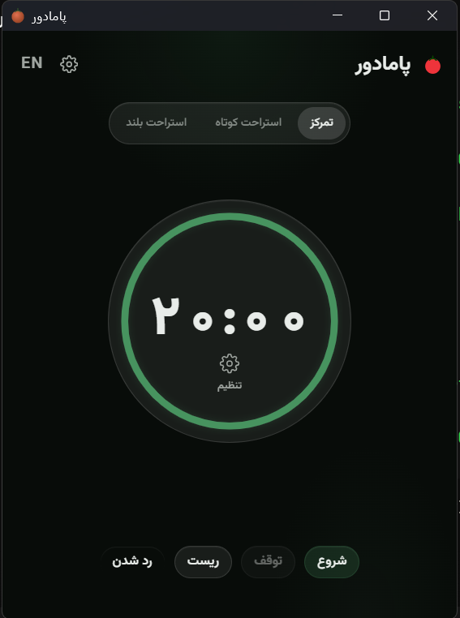

# پامادور 🍅

<p align="center">
  <a href="README.en.md">English</a>
</p>

**پامادور** یک تایمر پومودورو برای دسکتاپ است — ساخته‌شده با **Tauri 2** و **React**.

<p align="center">
  
</p>

## امکانات تایمر پومودورو پامادور

- دو حالت تایمر: تمرکز و استراحت کوتاه
- تنظیم زمان تمرکز از ۱ تا ۹۹ دقیقه یا انتخاب از پیشنهادهای سریع
- صدای سفارشی برای آلارم (فایل صوتی دلخواه یا صدای پیش‌فرض)
- ذخیرهٔ خودکار تنظیمات — هر چیزی که بچینید، بعد از بستن برنامه حفظ می‌شود
- دوزبانه: فارسی و انگلیسی
- در صورت پایان تایمر، پنجره از حالت کوچک‌شده برمی‌گردد (قابل تنظیم)

## تکنولوژی‌ها

| لایه | فناوری |
|------|--------|
| رابط کاربری | React 19 + TypeScript |
| ظاهر | CSS اختصاصی، فونت وزیرمتن |
| بدنه | Rust (Tauri 2) |
| ساخت | Vite |

## اجرا و بیلد

پیش‌نیاز: [Node.js](https://nodejs.org) و [Rust](https://rustup.rs).

```bash
npm install

# حالت توسعه — تغییرات به‌صورت خودکار اعمال می‌شود
npm run tauri dev

# بیلد نهایی
npm run build
npx tauri build --no-bundle
```

خروجی: `src-tauri/target/release/pamador.exe`

## ساختار پروژه

```
src/                  # فرانت (React)
  components/         # اجزای رابط کاربری
  hooks/              # منطق اتصال به Rust و پخش صدا
  i18n/               # ترجمهٔ فارسی و انگلیسی
src-tauri/
  src/timer.rs        # منطق تایمر و ذخیرهٔ تنظیمات
  src/lib.rs          # پنجره‌ها و رویدادها
```

## تایمر پامادور چطور کار می‌کند؟

منطق تایمر در Rust اجرا می‌شود، نه جاوااسکریپت. یک نخ پس‌زمینه هر ثانیه وضعیت را بررسی و از طریق رویداد به فرانت اطلاع می‌دهد.

## مجوز

آزاد — بدون مجوز مشخص.
